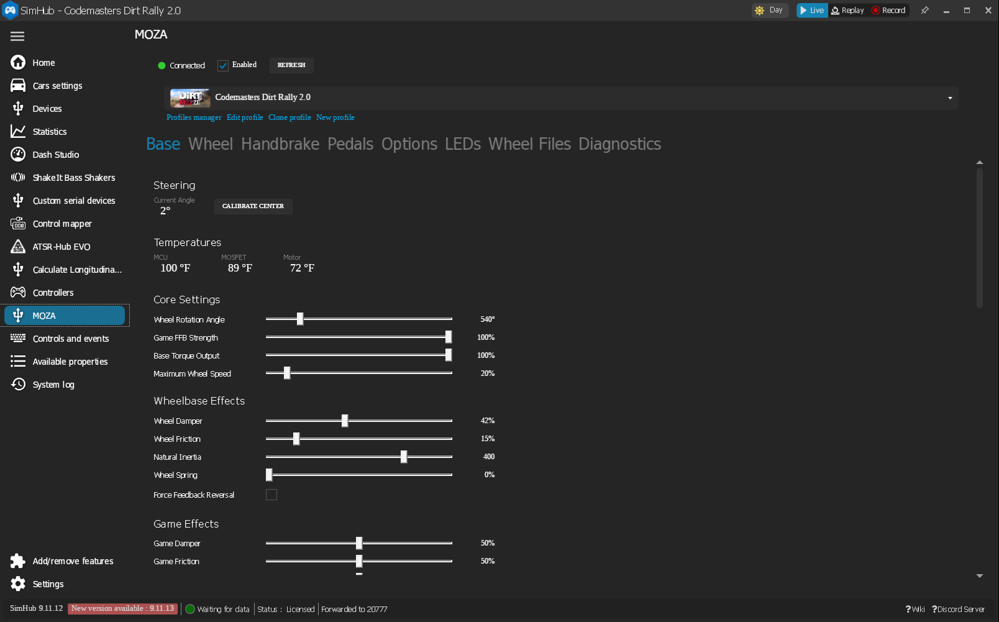
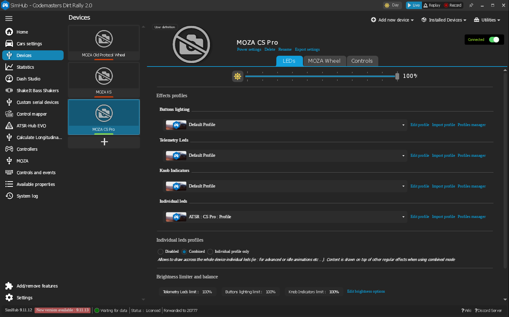
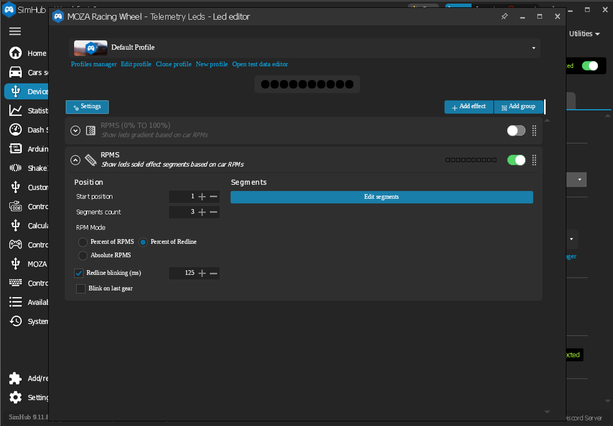
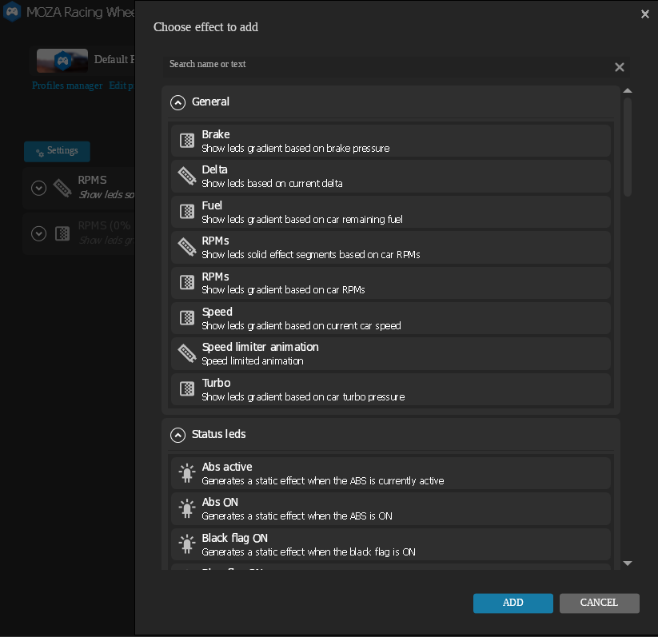

# MOZA Plugin for SimHub

[](https://github.com/giantorth/moza-simhub-plugin/releases/latest)
[](https://github.com/giantorth/moza-simhub-plugin/actions/workflows/build.yml)
[](https://github.com/giantorth/moza-simhub-plugin/releases/tag/dev-latest)
[](LICENSE)
[](https://discord.gg/J4enw43e62)

A SimHub plugin that communicates directly with MOZA Racing hardware over serial, providing full hardware configuration and LED control through SimHub's native device and effects system.

Built using the amazing work of [Boxflat](https://github.com/Lawstorant/boxflat) that reverse-engineered the [MOZA serial protocol](docs/moza-protocol.md).

## Why This Exists

MOZA makes excellent sim racing hardware, but their companion software — Pithouse — is Windows-only. Linux users have no official way to manage LED effects or stream telemetry to your wheel's dashboard. SimHub, on the other hand, runs on Linux (via Proton/Wine), opening the door for cross-platform hardware control with built-in telemetry support.

The goal is to expand the functionality of MOZA devices to a wider audience by providing tools that work across multiple platforms.  

**Expect a lot of updates in the coming weeks. Feedback and issues are appreciated.**



> [!NOTE]
> MOZA is a registered trademark of Gudsen Technology Co., Ltd. This project is not affiliated with, endorsed by, or sponsored by MOZA or Gudsen Technology. All trademarks are the property of their respective owners.

> [!IMPORTANT]
> **Close Pithouse before using this plugin.** Both applications communicate with MOZA hardware over the same serial port and cannot be open simultaneously. Pithouse must be fully closed (not just minimized) before SimHub can connect.

> [!WARNING]
> **USE AT YOUR OWN RISK.** This software communicates directly with force feedback hardware capable of producing high torque output that can cause serious injury or property damage. This plugin is provided "as is", without warranty of any kind, express or implied. The authors accept no responsibility or liability for any damage to hardware, injury to persons, or any other loss arising from the use of this software. By using this plugin, you acknowledge the inherent risks of controlling force feedback devices via third-party software and accept full responsibility for any consequences.

## Custom Effects managed by Simhub

https://github.com/user-attachments/assets/f5e77a1b-4b85-438c-957e-18c45d22a216

https://github.com/user-attachments/assets/94ad3e6a-9ae0-46a2-8e2f-4f4343326414

_Thank you to a gracious alpha tester who provided these custom effect and dashboard videos._

## Installation

Download the latest `MozaPlugin_v*.zip` from the [Releases](https://github.com/giantorth/moza-simhub-plugin/releases) page and extract into your SimHub installation directory:

- `MozaPlugin.dll` — copy to the SimHub root directory

Restart SimHub — the plugin appears under Settings > Plugins as "MOZA Control".

**Development builds.** The latest in-progress build from the `dev` branch is published as a pre-release: [MozaPlugin_dev.zip](https://github.com/giantorth/moza-simhub-plugin/releases/download/dev-latest/MozaPlugin_dev.zip). Expect bugs or broken features — use the stable release above if you need something reliable.

**Device setup:** Connect your hardware and restart SimHub. The plugin auto-detects connected devices (wheel model, dashboard) and deploys matching device definitions. A banner in the plugin settings panel will prompt you to restart SimHub, after which the devices appear under Devices ready to add. Requires SimHub 9.11+.

## Discord

[Join the Discord](https://discord.gg/hBHrNeKWSm) if you want to discuss features or development of this plugin.

## Features

### SimHub Device Integration

MOZA wheels and dashboards register as native SimHub devices, appearing in SimHub's **Devices** section. This enables full control of your LEDs through SimHub's effects pipeline — no separate telemetry mode needed.



- **Per-Model Device Definitions** — Each new wheel attached will get a generated device definition with the LED layout baked in. Definitions are deployed automatically on first detection — just connect your hardware, restart SimHub, and add the device. Requires SimHub 9.11+
- **LED Effects System** — Use SimHub's full Button and Telemetry effects configuration UI (RPM indicators, flags, speed limiter animations, scripted effects, etc.) to control your wheel and dashboard LEDs
- **Per-Game Device Profiles** — SimHub's device profile system saves and restores LED effect configurations per game
- **Model-Aware Connection** — Only the device matching the currently connected wheel reports as connected. Swap wheels and the correct device activates automatically
- **Separate Wheel & Dashboard Devices** — Each registers independently with its own profile and LED configuration
- **Individual LED Effects (Combined mode)** — SimHub per-LED effects are supported when the wheel device is set to Combined paddle mode. The virtual driver exposes RPM + button LEDs as one contiguous sequence (telemetry first, then buttons) so per-LED effects can target the whole strip



The plugin injects virtual LED drivers so SimHub's effects UI shows each device as connected, even though MOZA uses a proprietary serial protocol. The computed LED colors are forwarded to the hardware each frame.



SimHub contains many effects to choose from and this plugin supports any custom effects that target a device.

Tested:
- Old-protocol wheels (ES series)
- R5 Base
- Moza handbrake (directly attached)
- New-protocol wheels (Vision GS / GS V2P / TSW / KS Pro / CS Pro)
- Dashboard telemetry + screen updates (confirmed on Vision GS and CS Pro)

TBD:
- Stand alone dashboards
- Older generation wheels


### Per-Model LED Configuration

Each wheel model has a dedicated SimHub device definition with the correct LED layout. The plugin detects the connected wheel model via firmware queries and deploys the matching definition on first detection.

| Device Name | Model Prefix | RPM | Buttons | Flags | Button Mapping |
|-------------|:------------:|:---:|:-------:|:-----:|----------------|
| MOZA GS V2 Pro | GS V2P | 10 | 10 | No | Contiguous (5 left + 5 right) |
| MOZA CS V2 | CS V2.1 | 10 | 6 | No | Non-contiguous: positions 1,2,4,7,9,10 |
| MOZA CS Pro | W17 | 18 | 14 | No | Contiguous |
| MOZA KS Pro | W18 | 18 | 14 | No | RPM strip 3/12/3 (flags merged into RPM sequence) |
| MOZA KS | KS | 10 | 10 | No | Contiguous |
| MOZA FSR V2 | FSR2 | 10 | 14 | Yes | Contiguous |
| MOZA Vision GS | VGS | 10 | 8 | No | Contiguous |
| MOZA TSW | TSW | 10 | 14 | No | Contiguous |
| MOZA Racing Wheel | *(generic)* | 10 | 14 | No | Contiguous (fallback for unknown models) |
| MOZA Old Protocol Wheel | *(ES wheels)* | 10 | 0 | No | RPM LEDs only |
| MOZA Dashboard | — | 10 | 0 | Yes | RPM + flag LEDs |

On wheels with flag LEDs (FSR V2), SimHub sees a single combined telemetry strip laid out as `[flag 1-3][RPM 1-N][flag 4-6]`. Configure flag zones in SimHub's effects UI on those slots.

If your wheel model isn't listed or incorrect, the generic "MOZA Racing Wheel" definition is deployed. Check the SimHub log for the `[Moza] Wheel model:` line and report the model name string so a dedicated definition can be added.

### Dashboard Support

Wheels with an LCD dashboard (Vision GS and CS Pro confirmed; others likely work) can receive live telemetry from SimHub — speed, RPM, gear, lap times, fuel, tyre wear, and so on — streamed via MOZA's multi-tier binary telemetry protocol.

**Important caveats of the current implementation:**

- **You must provide the same `.mzdash` file currently loaded on the wheel.** The plugin streams game data into the wheel's active dashboard layout as-is; it does not install, switch, or author layouts. Build or edit layouts in the official MOZA dashboard builder and flash them to the wheel through Pithouse first, then pick the matching layout from the Dashboard dropdown on the wheel device page (or use "Load .mzdash…" to point at the file you flashed). If the channel bindings don't match, the displayed values will be wrong.
- **SimHub dashboards are not supported.** MOZA wheels render their LCD through firmware using MOZA's proprietary dashboard format. This plugin only streams game data into that format — it cannot push SimHub dashboard templates, HTML overlays, or custom layouts to the screen. Continue using the official MOZA dashboard builder for layout work.
- **Channel mapping.** The wheel device page has a "Channel mappings" expander to override which SimHub property drives each dashboard channel. Leave blank to use the plugin's built-in default mapping.

### Per-Game Profiles

All settings are stored per-game via SimHub's profile system and switch automatically when you launch a different game. A profile selector sits at the top of the plugin panel.

### Hardware Configuration

The plugin panel (Settings > Plugins > MOZA Control) exposes read/write control of wheelbase, wheel, handbrake, and pedal settings — rotation angle, FFB strength, damping, wheelbase/game effects, FFB equalizer, output curves, paddle modes, handbrake modes, pedal calibration — mirroring what Pithouse offers. Tabs auto-show/hide based on what's connected. The Diagnostics tab dumps live wheel identity, dashboard state, and session info for bug reports.

### SimHub Properties

The plugin exposes these properties for use in SimHub dashboards and overlays:

| Property | Type | Description |
|----------|------|-------------|
| `Moza.BaseConnected` | bool | Wheelbase connection status |
| `Moza.McuTemp` | double | MCU temperature (°C) |
| `Moza.MosfetTemp` | double | MOSFET temperature (°C) |
| `Moza.MotorTemp` | double | Motor temperature (°C) |
| `Moza.BaseState` | int | Wheelbase state |
| `Moza.FfbStrength` | int | FFB strength (%) |
| `Moza.MaxAngle` | int | Max steering angle (degrees) |

## Building from Source

See [DEVELOPMENT.md](docs/DEVELOPMENT.md) for build instructions (Windows & Linux cross-compilation), CI/CD pipeline details, and full architecture reference.

Protocol reference: [docs/moza-protocol.md](docs/moza-protocol.md). USB capture guide: [docs/usb-capture.md](docs/usb-capture.md). SimHub plugin API notes: [docs/simhub.md](docs/simhub.md).

## Project Structure

```
MozaPlugin.cs                      Main plugin class (IPlugin, IDataPlugin, IWPFSettingsV2)
MozaDeviceManager.cs               Read/write API for device settings
Protocol/
  MozaProtocol.cs                  Protocol constants (start byte, device IDs, checksums)
  MozaCommand.cs                   Message builder (read/write/int/array)
  MozaCommandDatabase.cs           150+ command definitions from serial.md
  MozaResponseParser.cs            Response decoder (bit 7 toggle, nibble swap, wildcard matching)
  MozaSerialConnection.cs          Serial port I/O with auto-discovery and background threads
  MozaHidReader.cs                 HID input reader — steering, pedals, paddles, handbrake via HidSharp
Telemetry/
  MozaData.cs                      Thread-safe data model for all device values
  TelemetrySender.cs               Multi-tier game data streaming to dashboard display
  TelemetryFrameBuilder.cs         Assembles bit-packed telemetry frames
  TelemetryEncoder.cs              Encodes game values to compressed wire formats
  TelemetryBitWriter.cs            LSB-first variable-width bit packer
  TierDefinitionBuilder.cs         Builds the 7c:00 tier-definition TLV (protocol v0 URL-subscription + v2 compact numeric)
  GameDataSnapshot.cs              Flat snapshot of SimHub game data for frame building
  DashboardProfile.cs              Channel definitions, tiers, and SimHubField enum
  DashboardProfileStore.cs         Parses .mzdash files and maps channels to SimHub fields
  DashboardUploader.cs             Session 0x04 .mzdash upload orchestration (path registration + file content)
  FileTransferBuilder.cs           Builds session 0x04 sub-message 1/2 payloads (MD5 + zlib content)
  ConfigJsonClient.cs              Session 0x09 configJson RPC — advertises the built-in dashboard library to the wheel
  SessionRegistry.cs               Tracks open 7c:00 sessions and their roles (mgmt / telemetry / file transfer / configJson / tile-server)
  SessionDataReassembler.cs        Reassembles chunked session data with CRC verification + zlib decompression
  WheelDashboardState.cs           Parses the wheel's session 0x09 state blob (dashboards loaded, disabled, library)
  TileServerStateBuilder.cs        Builds the empty tile-server JSON for session 0x03 uploads (ATS/ETS2 map metadata)
  TileServerStateParser.cs        Decodes session 0x03 tile-server state blobs received from the wheel
  PropertyCoercion.cs             Coerces SimHub property values (object) to double for bit-packing
  KnownSimHubProperties.cs         Curated autocomplete list for the channel-mapping ComboBox
  TelemetryDiagnostics.cs          Frame logging and test pattern generation
Data/
  Telemetry.json                   Telemetry channel URL → SimHub property mapping (410 channels, embedded resource)
Devices/
  MozaDeviceExtensionFilter.cs     Attaches extensions to MOZA devices in SimHub's device system
  MozaDeviceConstants.cs           Per-model GUIDs, GUID-to-model-prefix mapping, LED counts
  WheelModelInfo.cs                Per-model LED layout — button count, flag presence, index remapping
  MozaWheelDeviceExtension.cs      Wheel device extension — profiles, LED driver injection
  MozaWheelExtensionSettings.cs    Wheel settings for SimHub device profiles (includes telemetry)
  MozaWheelSettingsControl.xaml(.cs) Wheel device tab — LED config, dashboard telemetry, input settings
  MozaLedDeviceManager.cs          Virtual wheel LED driver — spoofs connection, forwards LED colors
  MozaDashDeviceExtension.cs       Dashboard device extension — profiles, LED driver injection
  MozaDashExtensionSettings.cs     Dashboard settings for SimHub device profiles
  MozaDashSettingsControl.xaml(.cs) Status panel for the dashboard device extension tab
  MozaDashLedDeviceManager.cs      Virtual dashboard LED driver — spoofs connection, forwards bitmask
DeviceTemplates/
  MozaWheelGeneric/                Generic fallback for unknown new-protocol wheels (embedded in DLL)
  MozaWheelOldProto/               Old-protocol (ES) wheels — RPM LEDs only (embedded in DLL)
  MozaDashShdp/                    Dashboard definition (10 RPM + 6 flag LEDs, embedded in DLL)
UI/
  SettingsControl.xaml(.cs)        WPF settings UI (Base, Wheel, Handbrake, Pedals, Hub, Options, Diagnostics tabs)
  ColorPickerDialog.xaml(.cs)      RGB color picker dialog
  MozaPluginSettings.cs            Persisted plugin settings (brightness, timings, colors)
  MozaProfile.cs                   Per-game configuration snapshot (80+ settings)
  MozaProfileStore.cs              SimHub profile storage integration
```
